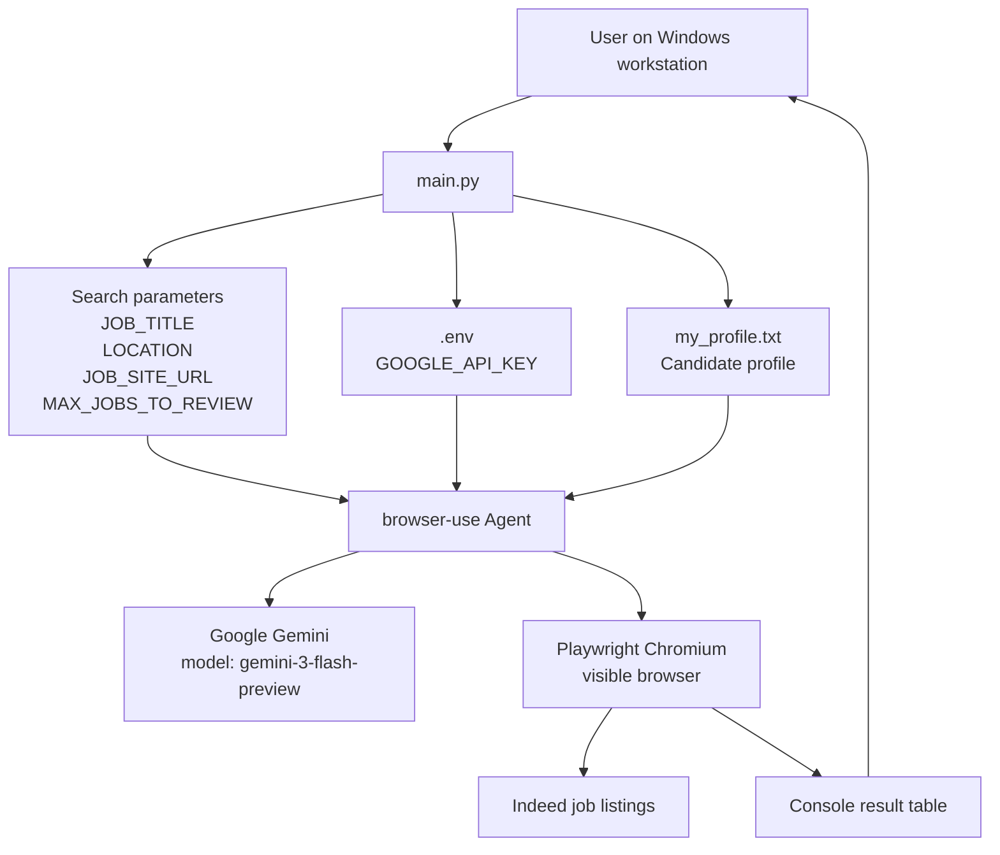

# Architecture

This repository is a local Python tool for reviewing job listings against a candidate profile. It is intentionally limited to browser-assisted research and summary generation. The application does not automate applying to jobs or interacting with sign-in, CAPTCHA, OTP, or form submission flows.

## System overview

The runtime flow is controlled by `main.py`, which:

- loads the `GOOGLE_API_KEY` value from a local `.env` file,
- reads a candidate profile from `my_profile.txt`,
- opens a visible browser session via Playwright,
- instructs a `browser-use` agent to review job listings on Indeed,
- compares each listing to the candidate profile,
- prints a concise summary table to the console.

## Component model

- `main.py`: orchestrates the workflow and defines the search parameters.
- `browser-use`: drives the browser automation and agent execution.
- `ChatGoogle`: provides the LLM integration with the configured Google model.
- `playwright`: provides the browser engine and browser automation layer.
- `.env`: stores the Google API key locally on the workstation.
- `my_profile.txt`: stores the candidate profile text used for comparison.
- Indeed: the external job board targeted by the current script.

## Runtime architecture

## Actual behavior in the current code

The current implementation is a review workflow rather than an application workflow. The prompt passed to the agent explicitly includes the following restrictions:

- no Apply
- no Easy Apply
- no Submit
- no Sign In
- no Create Account
- no form filling
- no CAPTCHA bypass
- no OTP bypass
- no login or payment circumvention

The script does not click apply buttons, does not submit job forms, and does not persist candidate details into a job portal.

## Design constraints

1. Local execution only: the project is designed to run on a developer workstation and not in a cloud deployment.
2. Visible browser workflow: `Browser(headless=False)` keeps the browser visible for operational transparency.
3. Manual review boundary: the output is a concise recommendation table, not an automated application record.
4. Single-site targeting: the job board is currently configured to `https://in.indeed.com`.
5. Human-in-the-loop safety: the script is limited to research and description matching.

## Planned enhancements

The following capabilities are explicitly planned rather than implemented:

- broader job-board support,
- configurable ranking and scoring,
- export of review results,
- scheduled or recurring review runs,
- richer profile parsing and structured matching,
- multi-site or multi-role comparison workflows.

## Security and governance considerations

The architecture intentionally keeps local secrets in a developer-managed `.env` file and local profile text in a user-managed file. There is no automated credential handling beyond the configured Google API key used by the LLM provider. The project is designed to stay within the browser session and user-controlled actions without bypassing website protections.
